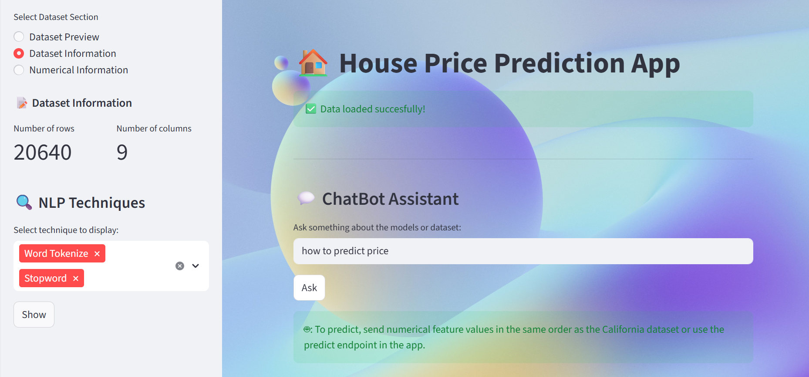
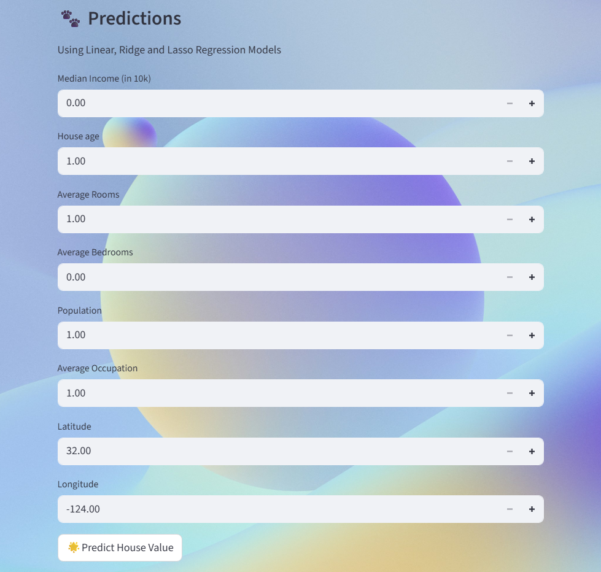

# House Price-Prediction Web Application 
This project is a machine learning-based house price prediction web application that allows users to estimate house prices based on various input features.
It includes user authentication, data preview, FAQ support, chatbot assistance and multiple regression models for prediction.

# Key Features
- User Authentication
- Data Preview
- Chatbot Assistence
- FAQs Section

# Technologies Used
- Backend: Python, Scikit-learn, Pandas, NumPy
- Frontend: Streamlit, Html/ CSS

# web app preview

This is a learning project developed for education purpose.
Prediction are based on trained datasets, results may not always correct.
